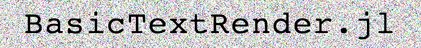

# BasicTextRender.jl

Warning.. very basic.. More of an experiment..
Concatenates characters from pre-rendered lookup images, then resizes and colors.

100% julia, no libs.

Prone to being a bit blurry.

Provides `rendertext` for generating a rendered image of a string and
`overlaytext!` for directly overlaying text on a loaded image.

## Generating rendered text
```julia
> using BasicTextRender
> img = rendertext("Hello world", height=30)
30×190 Array{RGBA{Float64},2} with eltype RGBA{Float64}:
...
> using FileIO
> save("img.png", img)
```


```julia
using BasicTextRender, ColorTypes
img = rendertext("Hello world", height=30, color=RGBA(1.0,0.0,0.0,1.0), backgroundColor=RGBA(1.0,1.0,0.0,1.0))
```


## Overlaying text on a loaded image

```julia
img = rand(RGBA{Float64},80,700)
overlaytext!(img, "BasicTextRender.jl", 60, (10,40))
save("logo.png", img)
```


## Speed (slow then fast-ish)
```julia
using BenchmarkTools
@btime rendertext("Hello world", height=30) #1.052 ms (667 allocations: 2.20 MiB)
```
The first time `rendertext` runs it should take ~4 seconds, as it loads the character lookup table.
